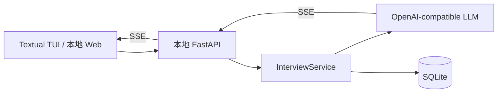

# Interview Simulator

> 面向技术岗位的本地 AI 模拟面试与复盘系统。支持题库选题、多轮追问、流式反馈、最终评分与本地练习记录。  
> 当前版本：**v1.1.0 本地 Web 增量**；当前已提供 **Agent 工程师赛道**。终端基线与迁移边界见 [v1.0.0 版本记录](docs/releases/v1.0.0.md)，本次增量见 [v1.1.0](docs/releases/v1.1.0.md)。

## 功能概览

- 从 Markdown 题库读取题号、模块、难度、题目和参考解析。
- 在终端按页选题，查看是否已练习及最近得分。
- 支持单题评分和最多 10 轮的深入面试。
- 基于 OpenAI-compatible Chat Completions 接入模型，获得追问与最终评价。
- 模型结果通过 SSE 增量展示；完整 JSON 校验成功后才写入 SQLite。
- 将会话、轮次、评分和题目练习进度保存到本地。
- 提供浏览器原生中英文作答框：以本地 Web 页复用既有 API、SSE 和 SQLite，不需要 Textual 输入。
- `scoring.feedback_style` 已接入模型提示词，可在 `detailed_interviewer` 与 `pressure_interviewer` 之间选择；高压模式只追问技术证据和边界，禁止羞辱或虚构回答。

## 架构



当前 TUI 只通过本机 HTTP/SSE 与服务层通信，这为后续替换为 Web 前端保留了边界。

## 快速开始

### 1. 环境要求

- Python 3.11+
- [uv](https://docs.astral.sh/uv/)
- 一个兼容 OpenAI Chat Completions 的模型服务
- 一个符合下方约定的本地 Markdown 题库

### 2. 安装依赖

```bash
git clone <你的仓库地址>
cd interview-simulator
uv sync --all-extras
```

### 3. 配置题库和模型

```bash
cp config.example.json config.json
cp .env.example .env
```

在 `config.json` 中修改 `question_bank_path`，指向你的题库目录；在 `.env` 中填写：

```dotenv
LLM_BASE_URL=https://your-provider.example/v1
LLM_API_KEY=your-api-key
LLM_MODEL=your-model-name
```

`config.json` 与 `.env` 均被 Git 忽略，不应提交个人路径或 API Key。

### 4. 启动

先验证题库是否能加载：

```bash
uv run interview-simulator --inspect
```

启动完整练习：

```bash
uv run interview-simulator
```

启动浏览器面试页（推荐 macOS 中文输入法使用）：

```bash
cd web-v2 && npm ci && npm run build && cd ..
uv run interview-simulator --web
```

首行会将 Vue 前端打包到本地未跟踪目录；之后命令会打印本机地址。在浏览器打开该地址，按 `Ctrl+C` 停止服务。它仅绑定 `127.0.0.1`，不对局域网公开。开发页面时，可先运行 `uv run interview-simulator --web --port 8000`，再在另一个终端运行 `cd web-v2 && npm run dev`；Vite 默认将 `/questions`、`/sessions` 请求代理到 `127.0.0.1:8000`，也可用 `VITE_API_BASE_URL` 指向其他 API 地址。

## 使用流程

1. 在题库列表中选择题目，查看模块、难度和练习状态。
2. 选择单题评分或深入面试。
3. 输入回答并提交。
4. 在深入面试中接收追问；单题模式或结束条件触发后接收最终评分。
5. 下次进入题库列表时查看该题的最新练习得分。

深入面试的结束条件：达到第 10 轮，或候选人明确回答“我不知道”“不会”“没有思路”“跳过”等无法作答语句。

## 题库格式

题库根目录下的模块目录必须以两位数字和连字符开头；题目文件名必须以三位题号开头。

```text
your-question-bank/
└── 01-agent-architecture/
    └── 006-agent-loop.md
```

最小题目示例：

```md
# 如何控制 Agent Loop？

> 分类：Agent 架构
> 难度：中级

这里写题目正文、背景材料和参考解析。
```

一级标题是必需项；`分类` 和 `难度` 元数据可选，缺失时分别回退为模块目录名与“未标注”。参考解析会交给模型作为评分依据，但不会作为终端界面的固定标准答案展示。

## 配置说明

`config.example.json` 中包含以下可调整项：

| 配置 | 作用 |
| --- | --- |
| `question_bank_path` | 本地 Markdown 题库目录 |
| `ui.page_size` | 每页题目数量，默认 15 |
| `scoring.temperature` | 模型生成温度，默认 0.9 |
| `scoring.feedback_style` | `detailed_interviewer`（默认）或 `pressure_interviewer`；两者都要求评价对应实际回答 |

## 本地 API

完整练习启动时会自动在 `127.0.0.1` 随机端口运行本地 FastAPI 服务。当前主要接口包括：

| 方法 | 路径 | 用途 |
| --- | --- | --- |
| `GET` | `/questions` | 分页读取题目和练习状态 |
| `POST` | `/sessions` | 创建面试会话 |
| `POST` | `/sessions/{session_id}/turns/stream` | 提交回答并接收 SSE 追问或评分 |
| `POST` | `/sessions/{session_id}/finish` | 主动结束会话并评分 |
| `GET` | `/sessions` | 查询历史会话 |
| `GET` | `/questions/{question_id}/reference` | 获取题目参考解析 |

## 测试

```bash
uv run --all-extras pytest -p no:cacheprovider --disable-warnings -v
```

截至 v1.0.0 的历史验证为 **36 passed, 1 warning**。模型请求和 SSE 解析使用 `httpx.MockTransport` 测试；这不等同于已经完成你所选模型供应商的真实端到端验收。v1.1 的验证结果以本次提交后的测试记录为准。

## 已知限制

- 当前是单用户、本地 SQLite、临时本机 FastAPI 端口的终端版实现。
- macOS + iTerm2 + Textual `TextArea` 下，直接中文输入的拼音候选词存在兼容问题；浏览器本地 Web 页使用原生输入框作为可用替代表现层，Textual 本身并未修复。
- 长会话尚未实现 token 预算、摘要压缩或会话恢复。
- 评分的严格程度仍受模型输出影响，尚未有独立评测集或人工校准流程。
- 当前没有账户、权限、并发控制、远程部署或任务取消能力。

详细边界见 [v1.0.0 版本记录](docs/releases/v1.0.0.md)。

## Roadmap

### v1.0.0

- [x] Markdown 题库
- [x] 单题评分与多轮深入面试
- [x] 本地 FastAPI、SSE、SQLite
- [x] OpenAI-compatible 模型适配

### v1.1.0：本地 Web 增量

- [x] 浏览器原生中英文输入框
- [x] Web 题库、作答、流式反馈与评分页面
- [x] 将评分风格接入提示词，并限制为可审计的预设

### v2.0.0：Web 迁移完善

- [ ] 刷新后会话恢复与流中断提示
- [ ] 用固定样例校准不同评分风格
- [ ] 根据多用户需求评估 PostgreSQL、认证与观测能力

## 贡献与安全

- 不提交 `.env`、`config.json`、`data/*.db`、`logs/` 或构建缓存。
- 提交前运行测试，并在 PR 中说明修改的题库、接口或面试状态影响。
- 请勿在 Issue、日志或提交记录中粘贴 API Key。

## License

当前仓库尚未声明开源许可证。公开发布前请根据使用方式补充 License（例如 MIT）。
